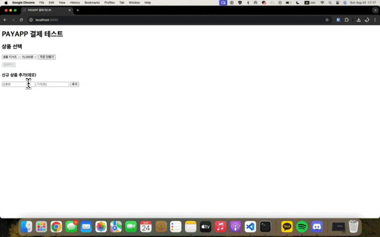

# PAYAPP FastAPI 데모



온라인 비즈니스를 만들기 위해 가장 중요한 요소 중 하나는 **결제 시스템**입니다.
하지만 대부분의 PG(Payment Gateway)사는 **사업자등록증이 없는 개인**의 결제를 받아주지 않습니다.

이 문제를 해결하기 위해 송금 스크래핑 방식도 고려해봤지만, 최근에 **개인 결제를 지원하는 [PAYAPP](https://www.payapp.kr/homepage/index.html)** 서비스를 찾게 되었습니다.

* 가입 즉시 결제를 받을 수 있음
* 정산 시 구비서류 제출 필요
* **보증보험 가입 조건**: 건당 결제금액 50만원 이상 **또는** 월 매출 500만원 이상일 경우
* **수수료**: 카드 4%, 계좌이체 2.3%
  → Toss Payments(카드 3.4%, 계좌 2.0%)보다 높지만, **가입비/관리비 0원 & 개인도 가입 가능**하다는 장점이 있습니다.

아쉬운 점은 **Toss Payments**처럼 개발자 문서가 친절하지 않다는 점입니다.
그래서 **FastAPI + SQLite + 바닐라 JS** 기반으로 PAYAPP 결제 시스템을 구현해보았습니다.

자세한 정보는 [PayApp 서비스 연동 매뉴얼](https://www.payapp.kr/dev_center/dev_center01.html)을 참고하세요.

---

## 기능 개요

* **상품/주문 DB**: SQLite로 관리
* **/orders API**: 서버가 상품 가격을 확정하고 주문 생성
* **프론트엔드(index.html)**: 서버가 내려준 금액/주문번호를 그대로 PayApp SDK에 전달
* **/webhook API**: PayApp이 결제 결과를 알려줌 → 서버에서 주문 상태 업데이트
* **/result API**: 결제 결과를 조회 가능

---

## 프로젝트 구조

```
.
├─ .env.example        # 환경 변수 예시
├─ static/
│  └─ index.html       # 프론트엔드(바닐라 JS)
└─ app/
   ├─ __init__.py
   ├─ main.py          # FastAPI 앱 엔트리포인트
   ├─ config.py        # 환경변수 로딩
   ├─ db.py            # DB 연결 및 초기화
   ├─ models.py        # Pydantic 모델 & Enum
   ├─ repositories.py  # DB CRUD
   └─ routers/
      ├─ orders.py     # 주문 생성/조회 API
      └─ webhook.py    # PayApp Webhook API
```

---

## 설정

### 1. PayApp 가입 및 연동 정보 확인

[PayApp 가입하기](https://www.payapp.kr/homepage/index.html)

* 판매관리자 → **설정 → 연동정보**에서 **연동 KEY / 연동 VALUE** 확인
* `.env` 파일에 입력

### 2. 환경 변수 설정

`.env.example` 파일을 참고하여 `.env` 파일을 생성하고 값을 채워주세요.

```bash
PAYAPP_USERID=판매자아이디
PAYAPP_LINKKEY=연동KEY
PAYAPP_LINKVAL=연동VALUE
SHOP_NAME=내쇼핑몰
BASE_URL=http://localhost:8000
```

> 로컬에서 ngrok으로 외부 접근을 열 경우, `BASE_URL`을 ngrok 주소로 바꿔야 Webhook이 정상 수신됩니다.

---

## 설치

```bash
pip install -r requirements.txt
```

---

## 실행

```bash
# 개발 서버 실행
uvicorn app.main:app --reload
```

혹은 FastAPI CLI를 사용할 수도 있습니다:

```bash
fastapi dev app/main.py
```

### ngrok을 통한 외부 노출

```bash
ngrok http 8000
```

생성된 ngrok 주소를 `.env`의 `BASE_URL`로 업데이트하세요.

---

## 테스트 방법

1. 브라우저에서 [http://localhost:8000](http://localhost:8000) 접속
2. 상품 선택 → `주문 만들기` 클릭
3. 서버가 가격을 확정하고 주문 생성
4. `결제하기` 버튼을 눌러 PayApp 결제 진행
5. 결제 완료 후 PayApp이 `/webhook`으로 결과를 전송 → 서버 DB 상태 업데이트
6. `/result?order_id=...` 경로에서 주문 상태 확인 가능
